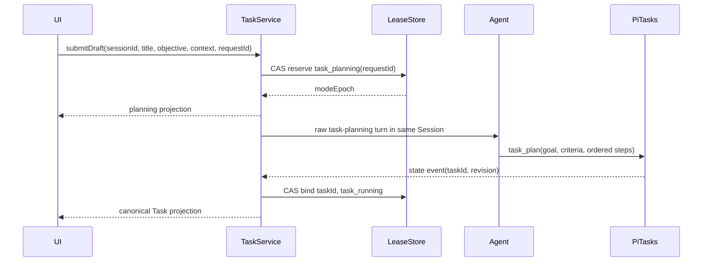

# 架构设计 - Story 9.41

**Story:** Agent/RoleAgent 任务入口与 pi-tasks 直接执行
**版本:** 2.1
**最后更新:** 2026-07-29

## 设计目标

使用 `pi-tasks` 建立正式任务的状态、步骤和证据契约，在当前 Agent/RoleAgent Session 中直接执行。普通聊天和正式任务在模型调用入口选择互斥 completion policy，避免 Chat Completion Guard 与 Task Runtime 重复判断或续跑。

## 核心不变量

1. 普通聊天只运行 Chat Completion Guard，正式任务只运行 Task Runtime。
2. `pi-tasks` custom entries/current branch state 是 Task contract 的唯一事实源。
3. OriginOS 不创建第二套 Step、Criterion、Evidence 或完成状态。
4. OriginOS 持久化的 lease 只控制“谁可以驱动下一轮”，不代表 Task 已完成。
5. 所有 task mutation 必须经过 A-01 验证的公开边界。
6. Task completion 必须由 `task_complete` evidence gate 接受。
7. 同一 Session/branch 同一时刻最多一个非终态 Task和一个有效 continuation。

## 总体架构

```text
Web Task Composer / Task Card
  -> Web service + Zustand projection store
  -> Desktop IPC / Web API boundary
  -> AgentTaskService (core feature)
       -> SessionExecutionLeaseStore
       -> PiTaskRuntimeClient (integration public API)
            -> Pi extension state event (read)
            -> approved task tool command gateway (write)
       -> TaskContinuationController
       -> EvidenceVerifier
       -> AgentManager current session
            -> OriginOSAgent.prompt/continue(completionPolicy)
```

### 唯一事实源与辅助状态

| 数据 | Owner | 是否 canonical |
|------|-------|----------------|
| Task/Step/Criterion/Evidence/Blocker/Decision | `pi-tasks` current branch state | 是 |
| completion gate | `pi-tasks task_complete` | 是 |
| chat/task mode、epoch、continuation nonce、预算 | OriginOS execution lease | 否，仅执行控制 |
| requestId -> planning/taskId | OriginOS idempotency map | 否，仅防重 |
| Task 卡片投影 | OriginOS cache/store | 否，只读且可重建 |
| Pi Session reference/branch identity | OriginOS SessionStore | 否，恢复定位 |

不得维护 `plan.json`、Goal state 或自定义 completion criteria。

## 模块边界

```text
packages/core/src/lib/features/agent-tasks/
  index.ts
  types.ts
  service.ts
  planning-coordinator.ts
  execution-lease-store.ts
  task-continuation-controller.ts
  evidence-verifier.ts
  projection.ts

packages/core/src/lib/integrations/pi-agent/task-runtime/
  index.ts
  types.ts
  pi-task-runtime-client.ts
  pi-task-command-gateway.ts
  pi-task-state-adapter.ts

packages/desktop/src/main/services/
  agent-task-service.ts

packages/web/src/
  components/agent-tasks/
  services/agent-task-service.ts
  store/agent-task-store.ts
```

依赖方向：

- integration 层定义并导出低层 `PiTaskRuntimeClient` 契约，不依赖 feature、desktop 或 web。
- agent-tasks feature 依赖 integration 公共 API 和 storage/shared/types。
- desktop service 只做 IPC、Electron Session 和环境适配。
- Web UI 不直接调用 `pi-tasks` 或解析 Pi state。
- feature 之间不导入内部实现，统一通过 `index.ts`。

## A-01 pi-tasks 集成门

> **状态更新（2026-08-01）：** A-01 拒绝 stock 组合后，A-02 已按
> [ADR-010](../../../architecture/decisions/ADR-010-controlled-pi-task-runtime-boundary.md)
> 建立受控 Runtime patch、`@originos/pi-tasks` 和 Adapter 公共边界。本节的禁止路径
> 继续有效；后续产品实现只能依赖 `@originos/pi-agent-adapter/task-runtime`。

### 已知公开能力

锁定版本的 `pi-tasks` 通过 extension 注册 task tools，并通过 state event 暴露只读状态。Story 不假设其存在 `create/get/cancel` 等宿主领域 API。

### 允许的写路径

首选路径是在相同 Pi Session/branch 的受控 extension execution context 中调用已注册工具：

```typescript
type PiTaskToolName =
  | 'task_plan'
  | 'task_next'
  | 'task_focus'
  | 'task_resume'
  | 'task_checkpoint'
  | 'task_granularity_check'
  | 'task_decompose'
  | 'task_update'
  | 'task_evidence'
  | 'task_decision'
  | 'task_complete';

export interface PiTaskCommandGateway {
  invoke(input: {
    scope: PiTaskExecutionScope;
    toolName: PiTaskToolName;
    args: unknown;
    command: TaskCommandContext;
  }): Promise<PiTaskToolResult>;
}
```

A-01 必须用集成测试证明：

- 调用发生在正确 Pi Session/branch。
- 使用与 Agent 工具调用相同的 schema validation、权限和 custom entry 写入路径。
- state event 能返回 mutation 后的 revision/snapshot。
- Electron 开发态和打包态均可加载。

如果 Pi Runtime 没有受支持的宿主 tool invocation：

1. 停止产品实现。
2. 在 ADR 中选择上游公共命令 API 或受控 fork。
3. 锁定版本、维护策略和迁移方案。
4. 更新本节后继续。

禁止路径：

- 导入 `pi-tasks` 私有 reducer/store。
- 解析或改写 Pi Session 文件。
- 伪造 custom entry。
- 复制 `pi-tasks` 状态机到 OriginOS。

## 运行作用域与持久 Lease

```typescript
export interface PiTaskExecutionScope {
  originSessionId: string;
  piSessionRef: string;
  branchId: string;
}

export type SessionExecutionMode =
  | 'chat'
  | 'task_planning'
  | 'task_running';

export type CompletionPolicy = 'chat_guard' | 'task_runtime';

export interface SessionExecutionLease {
  schemaVersion: 1;
  scope: PiTaskExecutionScope;
  mode: SessionExecutionMode;
  completionPolicy: CompletionPolicy;
  modeEpoch: number;
  expectedRevision: number;
  baselineTaskRevision?: number;
  requestId?: string;
  taskId?: string;
  continuationNonce?: string;
  acquiredAt: string;
  updatedAt: string;
}
```

`SessionExecutionLeaseStore` 必须：

- 通过文件存储基础设施版本化持久化。
- 使用 compare-and-swap 校验 `modeEpoch + expectedRevision`。
- 一个 `originSessionId + branchId` 只能存在一个有效 lease。
- Task planning/running/waiting/paused/recovering 期间保持 `task_runtime`。
- 切换模式时递增 modeEpoch 并撤销旧 continuation。
- 应用启动时先 reconciliation，不能直接按旧 `running` 自动续跑。

首版 active Task 期间拒绝 branch/fork 切换，避免把旧分支 Task 派发到新分支。

## completion policy 注入点

互斥必须发生在现有 Chat Guard 之前：

```typescript
async function runAgentTurn(input: AgentTurnInput): Promise<AgentTurnResult> {
  const policy = await completionPolicyResolver.resolve(input.scope);

  if (policy === 'task_runtime') {
    return originOSAgent.promptOrContinueRaw(input);
  }

  return originOSAgent.runWithChatCompletionGuard(input);
}
```

要求：

- `prompt()` 和 `continue()` 都接收或解析 `CompletionPolicy`。
- Task planning/running 不调用 Chat Guard 的语义 judge、recovery prompt 或 continuation。
- 通用日志、异常规范化和可见错误投递可以共享，但不能共享 completion decision。
- settled router 仅在一轮完成后通知 Task controller，不负责“事后关闭”Chat Guard。
- 测试必须 spy 两条路径，证明同一次 turn 只进入一个 policy。

## pi-tasks 状态读取

```typescript
export interface PiTaskRuntimeClient {
  subscribe(
    scope: PiTaskExecutionScope,
    listener: (snapshot: PiTaskContractSnapshot) => void
  ): () => void;

  waitForSnapshot(input: {
    scope: PiTaskExecutionScope;
    taskId?: string;
    afterRevision?: number;
    timeoutMs: number;
  }): Promise<PiTaskContractSnapshot>;

  invokeTool(input: {
    scope: PiTaskExecutionScope;
    toolName: PiTaskToolName;
    args: unknown;
    command: TaskCommandContext;
  }): Promise<PiTaskToolResult>;
}
```

读取规则：

- adapter 只消费公开 state event/current branch replay。
- snapshot 必须带 schemaVersion、taskId、branchId、revision 和 canonical fields。
- adapter cache 可用于等待事件，但进程重启后必须从 Pi branch 重放，不能把 cache 当事实源。
- 未收到匹配 state event 的 mutation 不视为成功。

## Task Command Context

```typescript
export interface TaskCommandContext {
  requestId: string;
  originSessionId: string;
  branchId: string;
  taskId?: string;
  expectedRevision: number;
  modeEpoch: number;
  issuedAt: string;
}
```

每条 mutation 必须校验：

- Session、branch、Agent ownership。
- modeEpoch 未过期。
- expectedRevision 与最新 snapshot 一致。
- requestId/commandId 未重复消费。
- Task 非终态且命令符合当前 execution control state。

## Task 创建协议

正式 Task 不能在 lease 之外先创建。创建流程：



Planning prompt 只包含：

- 用户批准的标题、目标和上下文。
- 要求生成可验证 acceptance criteria 与原子 ordered steps。
- 要求调用 `task_plan`，不要求输出完整 Task JSON 给 OriginOS。
- 当前操作系统、CWD、工具能力和预算。

异常与幂等：

- 先持久化 planning reservation，再发模型请求。
- `requestId -> reservation/taskId` 在 prompt 前落盘。
- 双击和 IPC 重试返回同一个 reservation。
- `task_plan` state event 到达后原子绑定 taskId。
- reservation 保存 planning 前的 baseline Task revision。进程在 state event 后、绑定前崩溃时，reconciliation 通过 branch replay 定位 baseline 之后唯一新增的 active Task 并绑定；无法唯一定位时进入可见冲突状态，禁止猜测或新建。
- planning 未创建 Task且预算耗尽时释放 lease回到 chat，UI恢复草稿。
- 已创建 Task但首次执行失败时保留 task lease并进入 paused/failed，不能创建第二个 Task。

## TaskContinuationController

控制器只做执行控制，不实现 Task 状态机：

```typescript
type TaskNextAction =
  | { type: 'execute_step' }
  | { type: 'verify_evidence' }
  | { type: 'wait_for_user'; blockers: string[] }
  | { type: 'attempt_complete' }
  | { type: 'pause'; reason: string }
  | { type: 'fail'; reason: string }
  | { type: 'none' };
```

决策顺序：

1. 校验 scope、lease、epoch、revision 和 Session ownership。
2. 用户消息、abort、provider retry、compaction 或 queued continuation 存在时不派发。
3. 有 blocker则 `wait_for_user`。
4. 有 pending/active Step则 `execute_step`。
5. 无 pending Step但 Criterion/Evidence 未通过则 `verify_evidence`。
6. 所有门控满足则 `attempt_complete`。
7. 达到预算、usage limit或 no-progress阈值则 `pause`。
8. 不可恢复错误则 `fail` 并投递可见状态。

每次 continuation：

- 生成持久化 nonce。
- 绑定 `taskId + branchId + modeEpoch + expectedRevision`。
- 入队前再次 CAS。
- 入队成功后记录 dispatchedAt。
- 消费后记录 consumedAt；reload 时同一 nonce 不重复派发。

控制器不得：

- 用正则或模型语义判断 assistant 文本是否完成。
- 因 assistant `stop` 直接完成 Task。
- 维护另一份 Step、Criterion 或 Evidence。
- 在 task 模式调用 Chat Guard continuation。

## EvidenceVerifier

`EvidenceVerifier` 校验产品级证据有效性，再通过 `task_evidence` 登记：

```typescript
export interface EvidenceCandidate {
  evidenceId: string;
  taskId: string;
  criterionId?: string;
  stepId?: string;
  taskRevision: number;
  kind: 'command' | 'test' | 'file' | 'tool_result' | 'user_confirmation';
  reference: string;
  summary: string;
  sha256?: string;
  verifier: string;
}
```

校验规则：

- 文件必须位于允许的数据/CWD范围，存在且 hash 匹配。
- command/test 必须有退出码和结构化结果摘要。
- tool result 必须能定位当前 Session 的 toolCallId。
- 用户确认必须绑定当前 taskId/criterionId。
- 旧 revision、错误 Task、缺少引用、hash 不匹配和 `not_verified` 拒绝。
- 相同 evidenceId 重放返回原结果。
- 大型证据正文不进入 IPC、日志或投影。

## Canonical 状态与执行控制映射

```typescript
export type TaskExecutionControlStatus =
  | 'planning'
  | 'queued'
  | 'running'
  | 'verifying'
  | 'waiting_user'
  | 'paused'
  | 'recovering'
  | 'failed'
  | 'idle';
```

映射原则：

| canonical Task | execution control | UI |
|----------------|-------------------|----|
| 尚未创建 | planning | planning |
| 非终态且等待 turn | queued | queued |
| 非终态且执行 Step | running | running |
| 非终态且补证据 | verifying | verifying |
| 非终态且有 blocker | waiting_user | waiting_user |
| 非终态且用户停止/预算/usage limit | paused | paused |
| 非终态且启动校准 | recovering | recovering |
| 非终态且不可恢复运行错误 | failed | failed |
| completed | idle | completed |
| cancelled | idle | cancelled |

`failed` 不等同于 canonical completed/cancelled。用户可查看最后 Task 状态，但必须显式恢复或取消。

## UI 投影

```typescript
export interface AgentTaskView {
  schemaVersion: 1;
  taskId?: string;
  sessionId: string;
  branchId: string;
  title: string;
  objectiveSummary: string;
  canonicalStatus?: string;
  executionStatus: TaskExecutionControlStatus;
  currentStep?: TaskStepView;
  completedSteps: number;
  totalSteps: number;
  criteria: TaskCriterionView[];
  blockers: TaskBlockerView[];
  evidence: EvidenceSummaryView[];
  revision: number;
  modeEpoch: number;
  updatedAt: string;
}

export interface EvidenceSummaryView {
  evidenceId: string;
  kind: string;
  referenceLabel: string;
  verificationStatus: 'verified' | 'rejected' | 'not_verified';
  summary: string;
  createdAt: string;
}
```

投影限制：

- Evidence、Criterion、Blocker 列表设置数量和字符串长度上限。
- 大型正文仅保留 artifact reference 和 hash。
- renderer 按 `branchId + modeEpoch + revision` 去重。
- 投影不可写回 canonical state。

## waiting_user 输入协议

用户通过原消息输入框答复。发送边界附加隐藏的结构化上下文：

```typescript
interface TaskUserReplyContext {
  taskId: string;
  blockerId: string;
  modeEpoch: number;
  expectedRevision: number;
}
```

处理顺序：

1. 校验当前 lease 和 blocker 仍有效。
2. 用户消息进入原 Session。
3. Agent通过 `task_update` 记录 blocker 解决结果。
4. 收到新 revision 后调用 `task_resume`。
5. Task Runtime继续；Chat Guard始终不参与。

## 持久化与恢复

`StoredSession` 需要新增版本化引用：

```typescript
interface StoredTaskRuntimeState {
  schemaVersion: 1;
  piSessionRef: string;
  branchId: string;
  lease: SessionExecutionLease;
  idempotency: Array<{
    requestId: string;
    taskId?: string;
    state: 'reserved' | 'created' | 'released';
  }>;
  projectionRevision: number;
}
```

恢复顺序：

1. 恢复 OriginOS Session和对应 Pi Session/branch。
2. 加载 lease，但先置 executionStatus=`recovering`。
3. 让 `pi-tasks` 从 current branch custom entries 重放 state。
4. 对比 ownership、taskId、revision、modeEpoch、pending user message、预算和 nonce。
5. lease 与 canonical Task 一致后才能恢复 running/paused/waiting。
6. 不一致时进入可见诊断，不创建替代 Task。

## IPC、错误和性能

- 创建、暂停、取消、答复、恢复是明确命令。
- 状态事件携带 sessionId、branchId、taskId、revision 和 modeEpoch。
- 错误事件必须同时更新 Task 投影，并向当前消息区域投递一次可见反馈。
- renderer 忽略旧 revision/epoch 和重复 errorId。
- 状态事件按关键边界发送，高频进度以 100ms-250ms 窗口节流。
- 单次 projection payload 上限 64KB。
- main process 不做同步文件 I/O或大型 JSON stringify。
- Task卡片不订阅 token delta；会话消息继续使用现有统一流式渲染能力。

## 安全

- 校验 originSessionId、piSessionRef、branchId、taskId、Agent 身份和 lease。
- 任务复用 Agent 原工具权限、CWD 和 agentBaseDir。
- Task不扩权，不因 internal continuation 绕过审批。
- 用户确认 Evidence必须来自当前会话。
- 日志、IPC和投影对凭据、任务正文和大型工具结果脱敏。

## 与 Story 9.42 的边界

本 Story 的 Task Step 只由当前 Agent直接执行。`PiTaskRuntimeClient` 和 `TaskContinuationController` 不感知 Workflow、Worker或DAG。

Story 9.42 后续可以消费相同 canonical Task：

- 不改变 chat/task completion policy。
- 不创建第二个父 Task。
- 不改变 `pi-tasks` 的完成权威。
- 多 Agent结果必须通过 Evidence Bridge登记。
- Workflow属于解决方案设计期产物，不在本 Story运行时选择或解释。

## AGENTS.md 符合性

- 业务逻辑在 core feature，不放入 Next.js app route。
- integration不反向依赖 feature/module。
- desktop只负责 IPC和Electron边界。
- Web使用Zustand，不引入其他状态库。
- TypeScript严格类型，不使用`any`。
- 使用本地文件/Pi Session state，不引入数据库。
- 不修改`.next`、`dist-electron`或`node_modules`。
- 文件持久化通过storage层，不在Electron main同步写盘。

## 变更历史

| 日期 | 变更 |
|------|------|
| 2026-07-28 | 创建初版 |
| 2026-07-28 | 改为 `pi-tasks` 任务内核和互斥执行路由 |
| 2026-08-01 | A-02 公共边界通过，补充 ADR-010 约束和 Story 解阻状态 |
| 2026-07-28 | 删除 Workflow、策略解析和自定义 Task Plan |
| 2026-07-29 | 重构公开集成门、planning reservation、completion policy、持久 lease、状态映射和恢复协议 |
