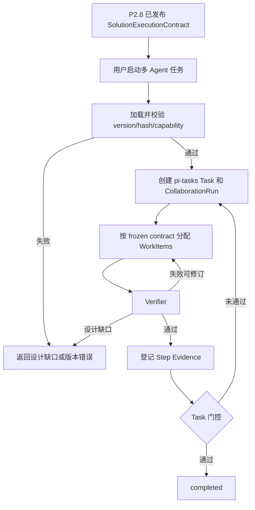

# 交互设计 - Story 9.42

**Story:** 多 Agent 任务与解决方案执行契约对齐  
**版本:** 2.0  
**最后更新:** 2026-07-28

## 设计边界

Workflow 的创建、编辑、拓扑调整、校验和契约发布由 Story P2.8 完成。多 Agent runtime 不执行 Workflow，也不提供 Workflow 编辑器、自动生成入口或运行时策略切换。

## 用户流程

## 解决方案设计阶段

- Workflow/Team 视图展示 Agent、Skill、trigger/depend/notify、I/O 和 verifier。
- 发布前展示 schema、拓扑、权限、预算、HITL 和 verifier 门控结果。
- 校验失败时禁止发布 execution contract。
- 发布生成稳定 solutionVersion、executionContractId 和 contractHash。

上述能力完全属于 P2.8。本 Story 只消费其产物并反馈 design gap。

## 运行时展示

- 顶部显示解决方案名称、版本和验证状态。
- 父 Task 展示当前 Step、Criterion、Evidence 和 Blocker。
- Run 展示活动/完成/失败 WorkItem 数、耗时和预算。
- WorkItem 按需展开，显示绑定的设计节点、Agent、Skill 和 verifier。
- 不显示“生成 Workflow”“修改拓扑”“自动切换模式”等操作。

## 状态与操作

| 状态 | 展示 | 操作 |
|------|------|------|
| validating | 正在校验方案执行契约 | 取消 |
| invalid_contract | 版本/hash/能力/拓扑错误 | 返回解决方案设计 |
| running | 按方案版本执行 | 停止、展开详情 |
| verifying | 正在验证结果 | 停止、查看证据 |
| waiting_user | 显示设计声明的 HITL 问题 | 答复、取消 |
| design_gap | 显示缺失契约和影响 | 返回设计、终止 |
| completed | 已验证结果和产物 | 打开产物 |
| failed | 运行失败和已完成范围 | 查看详情 |

## 错误反馈

- 未审批：`该解决方案版本尚未发布，不能启动运行。`
- hash 不一致：`解决方案执行契约校验失败，请重新发布。`
- 能力缺失：`设计指定的 Agent 或 Skill 当前不可用。`
- 设计缺口：`运行需要未在解决方案中定义的协作或验证规则，请返回设计阶段修正。`
- verifier 不可用：`结果尚未验证，任务不会标记完成。`
- evidence 写入失败：`验证结果已保留，但未能登记任务证据。`

## 可访问性与性能

- 状态变化使用 `aria-live="polite"`，高频 Worker progress 不逐条播报。
- 状态不能只靠颜色表达。
- WorkItems 默认折叠，避免大拓扑渲染卡顿。
- UI 订阅聚合快照，不接收 artifact 正文和 token delta。
- 长 ID 截断并支持复制。

## 变更历史

| 日期 | 变更 |
|------|------|
| 2026-07-28 | 创建初版 |
| 2026-07-28 | Workflow 编辑与审批移至解决方案设计，runtime 只展示契约执行 |
| 2026-07-28 | 移除设计流程职责，运行时入口从已发布执行契约开始 |

## 2026-09-14：项目语义执行规划补充

原项目任务详情展示对象、输入版本、WorkItem/Agent、已接纳结果、审批及阻塞。图和看板定位同一任务。重开窗口订阅原run，应用重启显示继续入口，核对后才执行。未知回执显示待核对并保留证据；设计缺口回P2新版本，不能在运行图热改契约。

完整依赖、状态所有权及验收场景见[主线规划](../../epic-ONT/project-semantic-execution-plan.md)。
