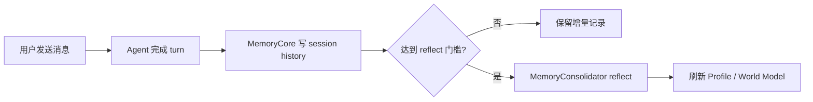

# 交互设计文档 - Story M.13

**Story:** 旧记忆机制清退  
**版本:** 1.0  
**最后更新:** 2026-09-10

## 设计说明

本 Story 无新增界面。用户继续通过 RoleAgent、ProjectAgent 和协作 Agent 正常对话；变化仅体现在后台不再双写历史和重复执行旧记忆逻辑。

## 用户流程

## 可观察行为

- 对话、窗口关闭和再次打开方式不变。
- 历史召回内容不重复。
- 已存在的旧记忆文件无需用户手动处理。
- 迁移异常写入日志，不弹出阻塞对话的 UI。

## 错误与恢复

- 旧历史损坏：跳过损坏行，保留原文件并记录日志。
- 迁移中断：下次启动可幂等重试。
- MemoryCore 写入失败：沿用现有错误处理，不回退启用旧 Writer。

