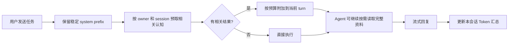

# 交互设计文档 - Story M.14

**Story:** 渐进式 Agent 上下文、KV Cache 与 Token 统计
**版本:** 1.0
**最后更新:** 2026-09-18

## 设计说明

用户仍从 Agent、RoleAgent、Project Agent、Skill 或多 Agent 协作入口发送消息。渐进加载发生在模型调用前，不能要求用户手动选择记忆文件。Agent/Skill 现有会话区域增加一个紧凑 Token 汇总，不新增页面。

## 用户流程

## 可观察行为

- 常规对话、历史恢复和协作运行方式不变。
- 与任务无关的历史经验不应改变回复视角或抢占当前指令。
- 需要完整模式或知识时，Agent 可主动使用已有工具加载；不向用户展示内部 hash、token 预算或缓存状态。
- 预取失败时仍正常回复，不弹出阻塞性错误。

## Token 汇总

现有 Agent/Skill 会话底部显示一行紧凑汇总：`总计 · 输入 · 输出 · 缓存读取 · 缓存写入`。点击后展开上下文估算：`稳定提示词 · 会话上下文 · 当前召回 · 历史消息`。

- Provider 未返回 cost 或 reasoning 时隐藏对应项。
- 上下文分区统一标记“估算”，不与 provider usage 混为一个总数。
- 恢复旧会话且没有 usage 时显示“该会话暂无 Token 统计”，不显示全零。
- 统计更新发生在 assistant message 完成时，不随每个流式 delta 重渲染。

## 错误与恢复

- Provider 检索失败：跳过该 Provider 的结果，其余结果继续使用。
- 预算超限：按确定性相关度截断，不截断来源/边界标记。
- 会话恢复：重建相同稳定前缀并复用 session id；若稳定配置已更新，允许前缀自然失效。
- 权限或 ownership 不一致：拒绝召回该内容，不降级为跨范围搜索。

## 可访问性与响应式

汇总区域复用现有文本、按钮和折叠组件，支持键盘展开与可读标签；窄窗体允许换行，不使用只靠颜色表达的缓存状态。
