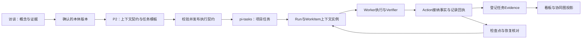

# 项目语义上下文与任务驱动多 Agent 实施规划

**日期：** 2026-09-14  
**状态：** Planning / 待设计评审；未实施  
**范围：** Epic 1、ONT、P2、9；主线负责人 Architecture/Core，产品与执行适配分别由 P2/Runtime 负责。

## 1. 目标与成功标准

访谈产出经确认的业务概念；项目设计据此定义语义上下文契约和任务模板；用户创建项目任务后，运行时绑定具体对象与事实版本，按契约组织多 Agent。项目任务看板与协同图呈现同一执行事实，窗口关闭或应用退出后能够核对并继续。

首个验收项目：客户需求分析 → 方案设计 → 方案审核。必须跑通正常交付、需求更新、并发修改、人工审批、中断恢复和结果去重，不能以类型或图形界面完成代替闭环验收。

## 2. 已有能力与缺口

| 现有资产 | 已有能力 | 本轮补齐 |
|---|---|---|
| Epic 1 / ontology / business-model.json | 访谈、旧概念模型及业务建模产物 | 概念稳定ID、来源、待确认项、版本化确认与迁移 |
| Epic ONT | Schema、Store、OSDK、Gate、Projection 的 Epic 级规划 | 业务状态、语义上下文协议和最小贯通样例；尚无完整实现 |
| P2.6 / P2.8 | I/O 类型；不可变执行契约的规划 | 输入输出绑定概念与状态，访谈来源追踪，发布门控与编译实现 |
| 9.41 / task-runtime | pi-tasks 投影、修订/cursor/epoch、当前会话继续任务能力 | 项目级查询与绑定；不得把已有单会话恢复当作多Agent恢复完成 |
| 9.42 | Task/Run/WorkItem 分层和精确版本规划 | 按语义契约实例化、调度门控、恢复与证据接纳 |
| DAG / Blackboard / EventStore | 节点状态、上游输出传递、共享数据与事件 | 任务实例标识，类型化事实引用，版本校验、持久恢复；Blackboard不作为第二事实源 |
| 协同图 | 角色/节点及依赖展示基础 | 同一Task/Run/WorkItem数据与看板互相定位 |
| 项目看板 | 本轮未发现完整实现 | 新增Story 9.43，聚合现有任务而非重新实现任务系统 |

核对入口：core task-runtime/types.ts、collaboration-runtime/engine/dag-executor.ts、agent-context-writer.ts；P2.8 和 9.42 的六份Story文档。现有DAG按agentId标识节点并按上游completed推进，不能直接承载同一Agent的多个并发任务实例。

## 3. 主链路

用户可从已发布方案创建任务，也可手动输入目标后选择适用的已发布任务模板。目标无法匹配时记录设计缺口，返回设计阶段补版本；运行时不能临时创造未审批的节点、权限或语义结构。

## 4. 数据所有权与版本

| 数据 | 唯一所有者/存储语义 | 消费方 |
|---|---|---|
| 已确认概念、关系、业务状态与Action定义 | ONT canonical ontology，版本化DataFile JSON | P2、运行时 |
| 候选概念/事实及访谈证据 | ONT提案/来源记录；未确认不进入正式事实 | 项目设计与确认界面 |
| 已接纳业务事实与Action回执 | ONT facts/operation records；JSONL及快照 | 执行器、查询与投影 |
| SemanticContextContract / SolutionExecutionContract | P2已发布契约；正文不可变，撤销状态独立 | 9.42 |
| 用户Task/Step/Criterion/Evidence/Blocker/完成状态 | pi-tasks公开边界及其持久会话分支 | 项目任务服务、看板 |
| Run/WorkItem/Attempt/lease/checkpoint | collaboration-runtime，复用现有事件存储 | 调度器、恢复协调器 |
| 上下文图/Blackboard/看板/协同图 | 可重建查询投影，携带revision/cursor | UI和Agent查询 |
| 项目任务索引、优先级、标签等扩展元数据 | core项目任务服务；不复制Task完成状态 | 看板和调度策略 |

项目任务索引保存projectId、taskId、sessionId、branchId、contractRef、runRefs。优先级/指派若已有公开Task字段则复用；缺少公开字段时仅增加版本化扩展元数据，不建立第二套Step/Evidence。索引损坏可由持久任务绑定重建。每个正式任务保留其会话分支定位，遵守现有同Session/branch最多一个非终态Task的约束。

P2.8是执行契约唯一类型定义方。9.42现有示例中的id/contractId、verify/verifyIntegrity命名在实施时统一消费同一公共类型，不能复制第二份契约。

### 三种状态分开

- 业务状态：例如需求draft/confirmed、方案draft/reviewed/approved，由ONT状态转换和Action约束。
- 用户任务状态：复用pending/active/blocked/review/done/cancelled；只有pi-tasks公开命令及完成门控能改变。
- 执行状态：Run/WorkItem/Attempt的排队、运行、核验、暂停、失败等；暂停或失败不伪造Task完成。

过期、阻塞和恢复待核对可作为原因/标记，不把所有组合塞进一个新的状态枚举。Agent是执行者，WorkItem是被执行的任务单元，身份键至少含runId/workItemId/attemptId，不能再只用agentId区分输入输出。

## 5. 访谈到设计：上下文必须有语义来源

### 访谈确认

每个概念有稳定conceptId、名称/别名、定义、属性与类型、关系、业务状态/转换、证据引用、确认状态和版本。来源记录引用访谈问题/回答或文档位置；修改保留历史。同义项给出合并候选，歧义或冲突不得默默合并。业务状态及权限也是设计信息，访谈未给出时必须澄清，不能靠LLM静默补成正式规则。

### 设计态上下文契约

在P2.8执行契约内增加由ONT公共DTO支持的semanticContext定义，并纳入整体contractHash，避免独立版本漂移。

| 字段组 | 必须表达 |
|---|---|
| 来源绑定 | projectId、ontologyId/version、solutionId/version、访谈证据引用 |
| 对象槽位 | conceptId、角色、基数、必需字段；例如customer:客户、requirement:需求 |
| 输入 | factType、对象槽位、查询/绑定规则、必需状态、是否要求最新版本 |
| 输出 | factType、目标槽位、产物类型、校验器、完成证据 |
| 状态与Action | 前置/后置条件、允许Action、权限上限、审核与冲突策略 |
| 上下文选择 | 必需事实、相关已确认决策、来源引用、可见范围和大小上限 |
| 任务模板 | designNodeId、目标、依赖、候选Agent/Skill、预算/重试和验收条件 |

设计界面增加“语义上下文”面板：从访谈概念选对象、配置输入输出、查看状态转移与缺口。用户不填写文件路径或哈希。发布前展示可读示例：“为客户甲，基于已确认需求第3版设计方案，由审核Agent确认后交付”。

发布门控检查引用存在、概念已确认、状态可达、输入来源完整、跨步骤语义兼容、Action权限、真实Verifier及HITL齐备；失败返回带节点/概念定位的DesignGap。

## 6. 运行态上下文与调度

每个WorkItem绑定contextInstanceId、contractId/hash、ontologyVersion、task/session/branch/run/workItem/attempt标识，具体对象ID、输入factRefs及版本、可见决策/产物引用、读集版本、允许Action、checkpointCursor。只读输入快照与后续提交结果分离。

上下文由确定性解析器按契约组装。检索只能补充权限范围内的参考信息，不能替代必需输入或绕过版本检查。长期身份/知识prompt快照保持冻结；执行上下文放到每个任务/步骤的结构化输入或查询工具响应，不能在每个token重写system prompt。

就绪条件 = 依赖WorkItem经核验完成 + 输入事实存在/版本有效 + 业务状态满足 + 执行者与权限可用 + 无未处理阻塞。上游仅自报completed不触发下游。

Worker提交候选输出；Verifier检查语义契约和产物；ONT Action重新核对当前读集/写集版本、权限及状态后提交。之后Evidence Bridge登记pi-tasks证据，最终由Task完成门控决定完成。

设计态拓扑冻结。运行态可以在已审批候选执行者中指派/交接，不能凭空增加节点、技能权限或回边。人工或Agent提出的新工作先作为任务提案；未覆盖的流程进入P2新版本，不热改active run。

## 7. 持久化、并发与恢复

沿用ONT规划的data/ontology目录以及P2已发布contracts目录。运行状态位于project-scoped runtime存储，由core resolver统一解析；候选逻辑目录data/projects/{projectId}/collaboration/runs/{runId}/，实施前先核对现有EventStore并复用/迁移，禁止另起平行事件总线。

- 采用现有JSONL事件记录和DataFile快照；快照含schemaVersion、cursor、binding与hash。快照可原子替换，已接纳事件是恢复依据。
- 按项目/聚合串行提交，跨进程通过唯一写入宿主或可验证的互斥机制协调；单进程内存锁不能声称覆盖Web/桌面多进程。
- 每次提交携带expectedRevision、attempt和lease epoch；重入、旧执行者迟到及旧UI命令被拒绝。运行中重新指派先暂停/回收旧lease，再派发新attempt。
- ONT事实、runtime事件和pi-tasks分别拥有状态，不存在跨文件天然事务。先持久化操作意图和稳定operationId，调用Action持久化其结果回执，再记录WorkItem接纳事件，最后幂等登记Evidence；任一步中断均通过operationId查询回执/补登，而不是盲目重做业务操作。
- 业务事实写入、Action回执与去重必须由同一可恢复操作记录关联；崩溃边界的提交协议先在ONT.2/5中验证，不仅依赖“原子rename”一句话。
- 外部副作用仅在对方支持幂等键/结果查询时自动重试。发送成功但回执未知且无法查询时进入待核对，允许人工确认；不承诺跨外部系统exactly-once。
- 审批保存requestId、待审对象/版本和决定；恢复不重复创建审批，旧版本批准不能应用到新结果。

| 中断前状态 | 恢复行为 |
|---|---|
| 未开始 | 重建输入并校验后排队 |
| 正在执行 | 核对lease、操作回执及checkpoint；旧进程失效后继续或生成新attempt |
| 事实已提交、Evidence未登记 | 从回执补登Evidence，不再执行Action |
| 等待审核/人工/外部输入 | 保留同一请求和等待原因 |
| 暂停 | 恢复展示，不自动开始；用户继续后重新门控 |
| 完成/取消 | 只读恢复，不能自动重放 |
| 契约/快照损坏或版本不支持 | 明确阻塞并提供修复路径，不静默回到latest |

关闭项目窗口：运行宿主仍在时可继续，重新打开订阅同一run。退出应用：尽力保存checkpoint，但正确性不能依赖退出回调；重新进入项目提供“继续任务”，核对后恢复。MVP默认不在重新启动应用时静默恢复有副作用的任务。

旧方案与运行记录保留只读浏览；显式转换经校验生成新版本/新run。业务概念或方案更新不会隐式改变已运行任务：默认绑定旧版本，但发布时声明为“必须最新”的输入在提交前需重新校验，过期输出转待核验而非自动覆盖。

## 8. 任务看板与协同图（Story 9.43）

项目提供“任务看板 / 协同图”两个入口，共用projectId/taskId/runId及服务端revision。现有Agent拓扑保留为设计/协作视图，运行视图展示具体WorkItem和负责Agent；点击任一项打开同一任务详情。

看板主卡是用户Task；卡内展示当前WorkItem/Agent和进度，展开查看子执行项，不把WorkItem伪装成第二套用户任务。

| 列 | canonical映射/规则 |
|---|---|
| 待执行 | pending；规划草稿单独呈现，不冒充正式Task |
| 进行中 | active；运行/暂停/失败作为执行徽标显示 |
| 阻塞 | blocked，展示谁/什么阻塞及解决动作 |
| 待审核 | review，进入实际审批或证据检查 |
| 已完成 | done，仅完成门控通过 |
| 已取消 | cancelled，默认折叠 |

首版支持：新建并绑定已发布方案/模板，搜索标题/ID，按Agent/优先级/阻塞原因筛选，任务详情、指派/优先级、暂停/继续/重试/取消、审批入口、产物与来源查看、图板跳转。

拖拽表达命令请求，不直接改Zustand状态或持久status。跨列动作按能力与门控验证，失败恢复原位并说明原因；不支持的转换不提供拖拽。保留键盘“移动/操作”菜单。并发操作采用expectedRevision，收到拒绝时刷新权威投影并提示变化，不静默覆盖。

列表按cursor分页，正文按需读取；显示每页50条，1000任务示例只渲染当前页/可见卡。使用现有AppWindowManager、shadcn、Tailwind与已有拖拽能力，无新UI框架。事件订阅优先，视图存活期间才启用必要降级刷新，不干扰正在编辑的表单。

首版不包含Linear外部同步、冲刺/Cycle、工时、任意自定义工作流、复杂报表和甘特图。

## 9. Epic职责与实施工作包

这是跨Epic规划，不是一个跨Epic巨型实施Proposal。下表每个Task独立建立OpenSpec Proposal；依赖完成后才创建实施Task工作区。所有条目均未实施。

| 批次 | Task ID / Story | 交付与写入责任 | 前置与验收门 |
|---|---|---|---|
| A | ONT1-T1 / ONT.1 | 概念ID、业务状态、事实/上下文DTO；core ontology | 先批准三层兼容映射；概念引用/状态转换正反例 |
| A | ONT7-T1 / ONT.7 | 提前定义最小来源、决策、context/checkpoint引用协议 | ONT1-T1；不做GraphRAG或独立图数据库 |
| B | ONT2-T1 / ONT.2 | 版本事实、操作记录、JSONL/快照与提交恢复 | ONT1-T1；崩溃/并发/回执一致性 |
| B | ONT3-T1 / ONT.3 | 访谈来源、旧模型迁移及兼容投影 | ONT2-T1；dry-run、备份、回滚与旧项目样例 |
| B | ONT4-T1 / ONT.4 | 引用/状态/权限/版本校验，结构化拒绝 | ONT1-T1；可与Store独立模块并行，写入范围分开 |
| C | ONT5-T1 / ONT.5 | Facts查询、Action提交及幂等回执 | ONT2-T1、ONT4-T1；事实接纳闭环 |
| C | ONT6-T1 / ONT.6 | 概念/事实输入输出契约和连通性校验 | ONT1-T1、ONT4-T1；被P2消费 |
| C | P28-T1 / P2.8 | 结合访谈编译上下文+模板，冻结发布 | ONT3/6/7最小能力、P2.5/6/7必要接线；缺口禁止发布 |
| D | 942-T1 / 9.42 | 项目Task绑定、Run/WorkItem实例化与语义门控 | P28-T1、ONT5-T1、9.41公开任务边界；不同任务不串上下文 |
| D | 942-T2 / 9.42 | 操作意图/接纳/Evidence恢复、lease fencing及故障注入 | 942-T1；重启/迟到/部分提交/重复审批均覆盖 |
| E | 943-T1 / 9.43 | 项目查询投影和命令适配、索引重建 | 942-T1；core业务服务与边界适配 |
| E | 943-T2 / 9.43 | 看板/详情与协同图联动、键盘及并发反馈 | 943-T1公共接口冻结后；Web组件/服务/store |
| F | ONT8-T1 / ONT.8 | 贯通访谈→设计→执行→看板→恢复的Web/Desktop验收 | 全部首版能力；旧项目不破坏，Windows/macOS恢复矩阵 |

批次A也可以先完成三节点样例的文档和契约测试草案，但不能让下游复制临时schema。恢复不延后到“生产加固”，必须先于正式任务看板交付。高级Semantica检索/图算法不作为此闭环前置。

当前缺少各ONT Story的详细规格：上述分配是任务级路线图，进入任一Task前补齐该Story六文件及具体测试、ADR/AGENTS必要修订、独立Proposal审核。P2.8/9.42沿用已有Story扩展；新增9.43六文件作为看板规格。不凭当前规划宣称全部Task已可直接编码。

## 10. 贯通验收矩阵（实施前用例，全部待执行）

| ID | Given / When | Then |
|---|---|---|
| E01 | 已确认客户/需求概念，发布方案并创建任务 | 每个WorkItem可追溯conceptId/ontologyVersion/contractHash及访谈来源 |
| E02 | 访谈概念未确认、关系歧义或必需状态缺失，尝试发布 | 返回定位明确的DesignGap，不产生可启动契约 |
| E03 | 需求输入缺失、状态未确认，上游却报告completed | 下游阻塞；不调用Worker、不写事实 |
| E04 | 同一Agent接手两个客户任务 | run/workItem/attempt及事实绑定隔离，Blackboard键不串任务 |
| E05 | 设计新版本在旧任务执行中发布 | 旧run保持原契约；无latest隐式切换 |
| E06 | Worker输入版本过期或两个Worker提交同一聚合 | 一个合法提交成功，另一个明确冲突/待核对，不丢更新 |
| E07 | Worker自报成功但Verifier失败或无权限 | 不接纳业务状态，不登记passed Evidence，不完成Task |
| E08 | 在意图后、Action后、接纳后、Evidence前后分别强制退出 | 可核对恢复；已接受事实/Evidence不重复，无幽灵完成 |
| E09 | 关闭窗口、退出应用后返回原项目任务 | 同一Task/Run和审批请求恢复；暂停不自动续跑，取消不复活 |
| E10 | 外部操作已发出但回执未知，且对方不能查询/去重 | 明确待核对，不自动重发 |
| E11 | 旧Agent持有过期epoch，重分配后提交迟到输出 | 拒绝迟到提交，保留审计，不覆盖新attempt |
| E12 | 看板与协同图同时打开、用户并发拖动/审核 | 同一revision投影；非法转换拒绝并回滚UI |
| E13 | Task只有WorkItem完成而缺Criterion证据 | 看板保持未完成；只有pi-tasks完成门控接受后进入已完成 |
| E14 | 删除可重建索引/缓存或损坏快照、撤销契约 | 前者重建；后者可定位阻塞；均不重做已提交动作 |
| E15 | 非授权项目、事实类型或路径被请求 | 数据层和命令层均拒绝，正文/凭据不泄露至投影 |
| E16 | 1000任务、50条分页、多个Agent更新 | 只加载当前页摘要；交互响应按现有500ms要求验证，编辑表单不重建 |

测试分层：ONT纯业务/存储单测；P2发布和迁移集成；runtime真实Worker/Verifier与故障注入；看板组件/命令测试；桌面实际打包进程关闭/重启E2E。不用mock成功代替恢复与副作用验收。

## 11. 需要在实现前收敛的设计点

1. AGENTS.md仍强制Domain/Concept/Instance：首版保留外层映射（Domain为领域，Concept为带属性/状态/Action引用的类型，Instance为业务对象），新增语义必须通过ONT1-T1的ADR确认；不直接把Epic规划当全局规约修订。
2. 核对受控pi-tasks公开API对项目索引、指派和优先级的支持；本次只按已验证投影状态规划，不假定未存在的公开命令。
3. 定义每种Action的可重试/可查询/需人工核对能力；未知副作用不自动补偿。
4. 确认现有EventStore的分区和快照结构，选择最小适配与迁移，避免双写事实源。

以上是可在对应Task设计阶段通过代码审查/试验收敛的技术门，不需要用户先填写实现细节。

## 12. Semantica参考与适配边界

参考semantica-agi/semantica的稳定实体关联、来源追踪、上下文关联、决策记录和持久恢复思路。参考的是概念与协议；不在本次规划中引入Python服务、图数据库、向量依赖或替换pi-tasks。确定性门控和提交协议由OriginOS负责，不能把检索到的描述当作授权或当前业务状态。

来源（查阅2026-09-14）：
- [Semantica Context模块](https://github.com/semantica-agi/semantica/blob/main/docs/reference/context.md)
- [Semantica概念文档](https://github.com/semantica-agi/semantica/blob/main/docs/concepts.md)
- [Epic ONT](README.md)
- [P2.8](../epic-P2/story-P2.8/README.md)
- [9.42](../epic-9/story-9.42/README.md)
- [9.43项目任务看板](../epic-9/story-9.43/README.md)

本规划未执行应用代码变更，也未把Planning改为Done。所有性能、恢复和安全验收项均是待实施要求。
