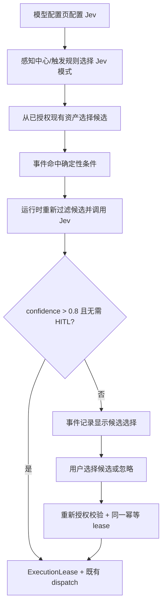

# SENSE.15 产品交互设计

## 1. 设计原则

- 只使用两个既有入口：模型配置页与感知中心；不增加导航项或第三个配置页。
- 用户始终能区分“模型建议”“授权门禁”“最终执行”。概率不是授权。
- 低置信、需 HITL 和 Provider 故障都显式可见；禁止静默降级或猜测目标。

## 2. 用户流程

### 2.1 模型配置页

在 `SettingsDialog` 的现有 LLM 配置之后增加「Jev 决策模型」section；它不是 Anthropic/OpenAI tab，也不会成为 Agent 对话模型。

| 项目 | 交互 |
|---|---|
| 启用 | switch；未配置凭据时不能启用 |
| Base URL | 默认 `https://api.typesafe.ai`；保存前校验 HTTPS，开发环境可允许 loopback |
| Model | 默认 `jev-latest` |
| API Key | password 输入；提交后立即清空，不提供明文查看按钮 |
| 凭据状态 | `未配置` / `已由安全存储配置` |
| 清除凭据 | 独立危险操作，二次确认；空输入表示保留现有凭据 |

Jev section 的保存按钮和设置对话框底部“保存”按钮都会提交 Jev 配置。保存中禁用重复提交；成功提示“Jev 配置已保存”。安全存储不可用时提示“当前运行环境不能安全保存 API Key，请在桌面应用中配置”，不得回退本地存储或环境变量。

### 2.2 感知中心「触发规则」

规则向导新增「路由方式」：

- `固定目标`：保留当前单目标流程，历史规则默认此模式。
- `Jev 决策`：显示候选多选列表、保留动作与只读策略说明。

候选列表只展示当前 connector 下已存在且已启用授权的项目、角色和 Skill。每项显示类型、名称、ID 和授权范围；失效项不进入可选列表。保留动作首版为“忽略事件”和“通知我选择”。

页面固定提示：`仅置信度严格高于 0.8 且无需人工确认时自动执行；0.8 也需要确认。` 阈值首版不提供输入框。若 Provider 未配置，可保存停用规则；启用决策规则时阻止提交并引导到现有模型设置。

规则卡显示：决策模式、候选数量、目录版本、阈值、HITL 状态。授权被撤销后显示“候选已变化”，但运行时仍以最新授权为准。

### 2.3 感知中心「事件记录」

事件详情在现有 rule trace 中增加决策阶段：

- 自动执行：显示选择、confidence、完整概率分布折叠区、HITL 判定、lease/resultRef。
- 待人工选择：黄色状态“等待你的选择”，列出候选、概率、目标类型与“选择此目标”；同时提供“忽略”。
- Provider 失败：显示安全错误码、`重试决策` 与人工候选；不显示供应商原始响应。
- 候选失效：对应按钮禁用并提示“目标已删除或授权已撤销，请刷新候选”。
- 已解决：全部操作禁用，显示最终操作者（自动/用户）和时间；重复点击返回既有结果。

IM 来源的低置信事件使用同一事件详情，不在 IM 会话中猜测目标。现有系统通知能力可提示“有感知事件等待选择”，点击后聚焦该事件；通知失败不改变待处理事实。

## 3. 状态与错误反馈

| 状态/错误码 | 用户反馈 | 恢复 |
|---|---|---|
| `JEV_NOT_CONFIGURED` | 决策模型未配置 | 打开模型设置或人工选择 |
| `JEV_UNAUTHORIZED` | Jev 凭据无效 | 重新提交 API Key |
| `JEV_RATE_LIMITED` / `JEV_OVERLOADED` | 决策服务繁忙 | 有界重试或人工选择 |
| `JEV_TIMEOUT` / `JEV_INVALID_RESPONSE` | 本次无法可靠判断 | 人工选择；可重试 |
| `DECISION_CANDIDATE_NOT_AUTHORIZED` | 候选已失效 | 刷新并选择其他候选 |
| `DECISION_ALREADY_RESOLVED` | 本事件已处理 | 展示既有回执，不重复执行 |

错误使用 `role="alert"`，异步状态使用 `role="status"`；候选组使用 `fieldset/legend`，键盘可完成配置和选择。桌面宽屏双列、窄窗单列，保持 400×300 最小窗体可用；颜色沿用 blue/gray/yellow/red/green Tailwind 预设。

## 4. 空状态

- 无授权目标：显示“先到目标权限添加可触发资产”，Jev 规则不能启用。
- Provider 停用：规则保留但不调用 Jev，事件进入可解释的待处理状态。
- 无待处理决策：事件页保持现有事件列表，不增加空白子页面。
