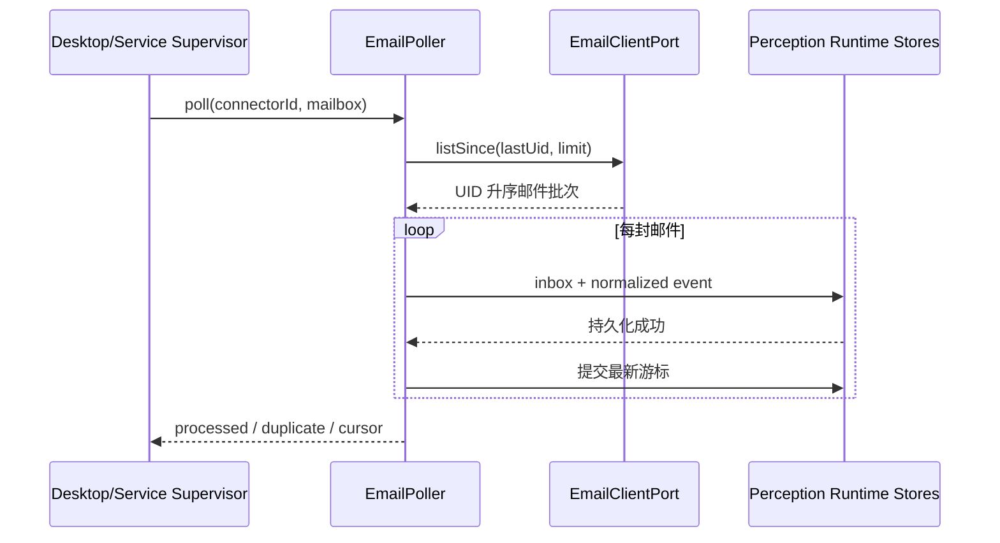

# SENSE.3 交互设计

## 适用性

本 Story 为后端 Connector 边界，不新增用户界面。未来配置界面只能展示连接状态、mailbox、游标时间和脱敏错误，不得展示密码或 token。

## 运行流程

## 状态与反馈

- `idle`：等待下一次计划。
- `polling`：正在只读拉取。
- `healthy`：本批完成，记录最新成功时间。
- `degraded`：连接或单封处理失败，保留游标并等待重试。
- `reset`：检测到 UIDVALIDITY 改变，记录审计并采用安全基线。

运维错误需给出 connectorId、错误码和可重试性；日志必须脱敏。此 Story 无响应式或可访问性 UI 要求。
