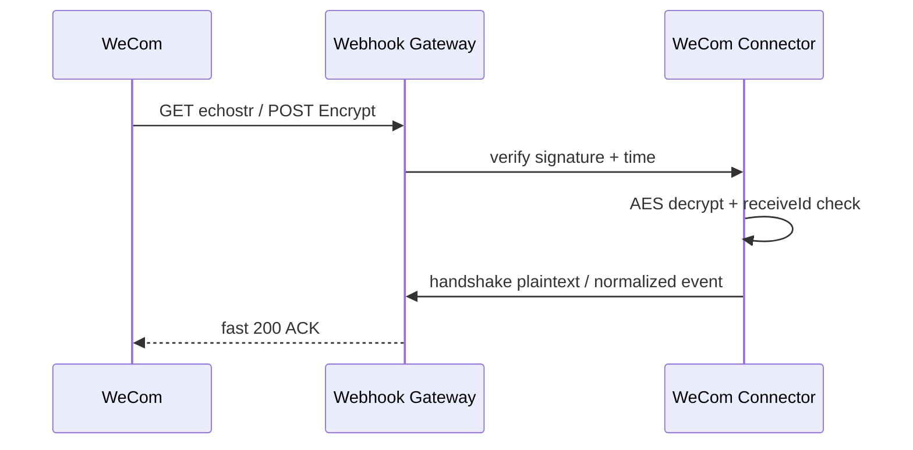

# SENSE.4 交互

本 Story 无产品 UI。管理员在企业微信控制台配置 callback URL、Token 和 EncodingAESKey；OriginOS 仅展示 secret reference 与脱敏健康状态。

```mermaid
sequenceDiagram
  participant W as WeCom
  participant G as Webhook Gateway
  participant C as WeCom Connector
  W->>G: GET echostr / POST Encrypt
  G->>C: verify signature + time
  C->>C: AES decrypt + receiveId check
  C->>G: handshake plaintext / normalized event
  G-->>W: fast 200 ACK
```

无效签名返回 401，过期或重放返回 409，格式/解密错误返回 400；日志不包含 Token、AES key 或解密后的完整正文。
