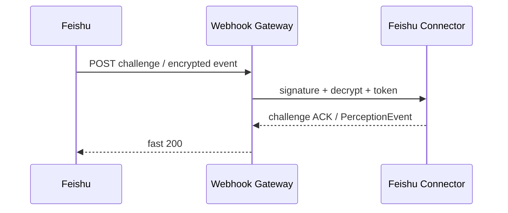

# SENSE.5 交互

本 Story 无 UI。管理员在飞书开发者后台启用机器人、配置事件订阅 URL、Verification Token、Encrypt Key 和事件权限。

```mermaid
sequenceDiagram
  participant F as Feishu
  participant G as Webhook Gateway
  participant C as Feishu Connector
  F->>G: POST challenge / encrypted event
  G->>C: signature + decrypt + token
  C-->>G: challenge ACK / PerceptionEvent
  G-->>F: fast 200
```

错误只返回结构化 code；日志不展示 token、encrypt key 或完整解密正文。长连接的状态交互留给后续 Desktop/Service supervisor。
