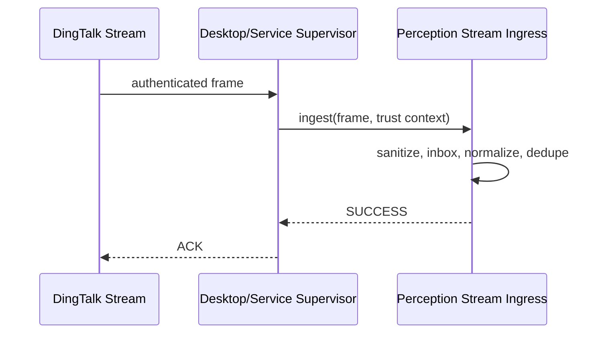

# SENSE.6 交互

本 Story 无 UI。运行链路：Desktop/Service supervisor 使用 secret reference 建立 Stream；收到 frame 后标记已认证并调用 core ingress；成功返回 SUCCESS，过载返回 LATER，CALLBACK 失败暂不 ACK。

运维仅显示连接/重连/积压/最近成功时间和脱敏错误；不得显示 ClientSecret 或 sessionWebhook。
