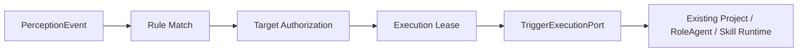

# SENSE.7 交互

本 Story 核心为后端路由，不新增配置 UI。未来规则管理界面只能选择注册目标和白名单条件，不提供代码编辑器。

```mermaid
flowchart LR
  E[PerceptionEvent] --> M[Rule Match]
  M --> A[Target Authorization]
  A --> L[Execution Lease]
  L --> P[TriggerExecutionPort]
  P --> T[Existing Project / RoleAgent / Skill Runtime]
```

状态：ignored、matched、denied、leased、dispatched、failed。用户可看到 connector/rule/target/lease 与脱敏原因；高风险动作继续进入既有 HITL。
